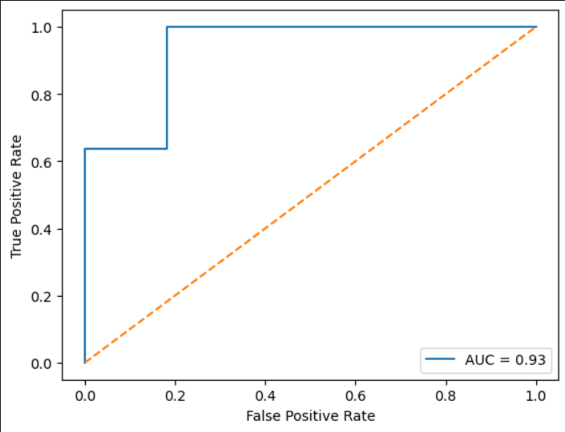
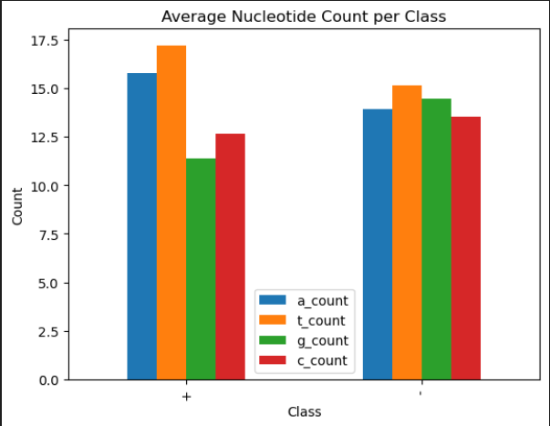
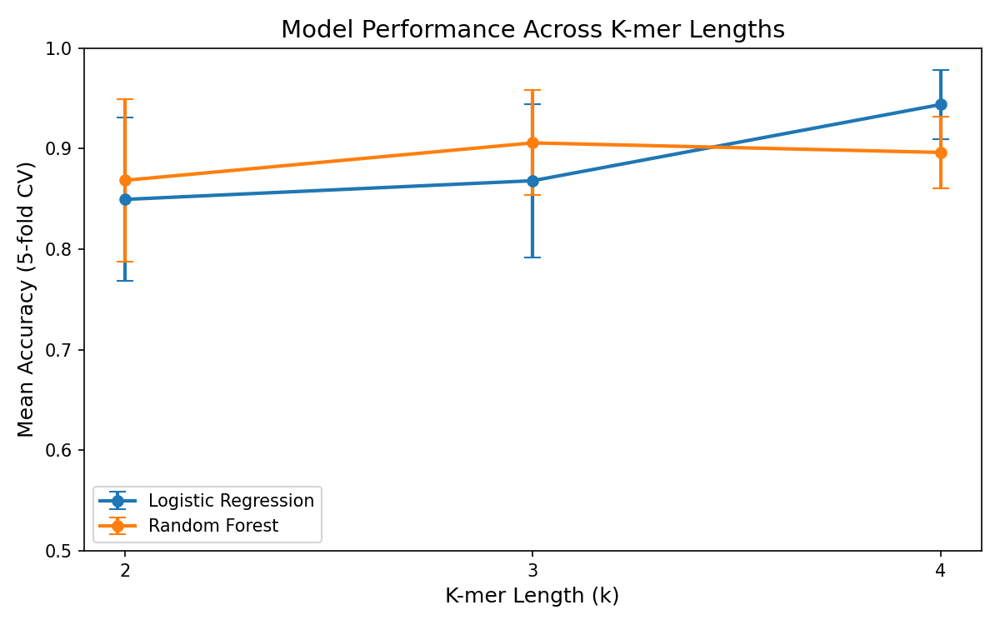

# DNA Promoter Classification Using Machine Learning

## Overview
A machine learning pipeline to classify DNA sequences as promoter or 
non-promoter using k-mer frequency features.

Promoters are regulatory DNA regions that signal RNA polymerase where 
to begin transcription. Computational detection of promoters has 
applications in genomics, disease research, and synthetic biology.

## Dataset
-dataset:1
- Source: UCI Machine Learning Repository (Promoter Gene Sequences)
- 106 sequences: 53 promoters (+) and 53 non-promoters (-)
- Organism: E. coli

- dataset:2
- Source: RegulonDB Sigma70 Benchmark Dataset
- 2,141 sequences: 741 promoters and 1,400 non-promoters
- Organism: E. coli
- Sequence length: 81 bp
- Note: Dataset has class imbalance (35% promoter, 65% non-promoter)
  handled using class_weight='balanced'

## Methods
### Feature Engineering
- K-mer frequency encoding for k = 2, 3, 4
- Each sequence converted to a vector of k-mer counts

### Models
- Logistic Regression
- Random Forest

### Evaluation
- Accuracy, Precision, Recall, F1-score
- Confusion Matrix
- ROC-AUC Curve

## Results
| Model | k | Test Accuracy | Recall (Promoter) | Recall (Non-Promoter) |
|---|---|---|---|---|
| Logistic Regression | 3 | 0.812 | 0.91 | 0.71 |
| Random Forest | 3 | 0.824 | 0.91 | 0.74 |

## Visualizations




## Limitations
- Small dataset (104 sequences) causes overfitting
- Train accuracy = 1.0 vs test accuracy = 0.81 indicates memorization
- Future work: larger dataset, cross-validation, CNN model

## How to Run
```bash
pip install -r requirements.txt
jupyter notebook notebooks/promoter_classification.ipynb
```

## Future Work
- Larger dataset from EPDnew
- 5-fold stratified cross-validation
- XGBoost and SVM models
- 1D CNN on one-hot encoded sequences
- Biological interpretation of top features
